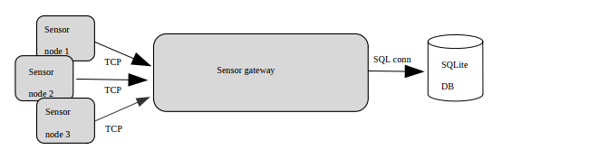
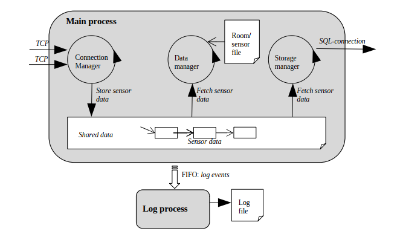

*********************************************************************
**Project: SENSOR-GATEWAY**

1.  Command: make all

2.  Server:
 - Get IP (server address)   
Command: ifconfig 
 - Run server    
Command: ./server port-number

3.  Sensor
 - Run sensor
 - Command: ./client server-address port-number SensorNodeID

*********************************************************************
**SYSTEM DESCRIPTION**

*Sensor Monitoring system:*     
The sensor monitoring system consists of sensor nodes measuring the room temperature, a sensor gateway that acquires all sensor data from the sensor nodes, and an SQL database to store all sensor data processed by the sensor gateway. A sensor node uses a private TCP connection to transfer the sensor data to the sensor gateway. The SQL database is an SQLite system. The full system is depicted below.

The sensor gateway may not assume a maximum of sensors at start up. In fact, the number of sensors connecting to the sensor gateway is not constant and may change over time.

Working with real embedded sensor nodes is not an option for this assignment. therefore, sensor nodes will be simulated in software.

*Sensor Gateway:*     
A more detailed design of the sensor gateway is depicted below. In what follows, we will discuss the minimal requirements of both processes in more detail.

*********************************************************************
**Minimal requirements**    
*Req 1.*    
The sensor gateway consists of a main process and a log process. The log process is started (with fork) as a child process of the main process.  

*Req 2.*     
The main process runs three threads: the connection, the data, and the storage manager thread. A shared data structre is used for communication between all threads. Notice that read/write/update-access to the shared data needs to be *thread-safe*!

*Req 3.*     
The connection manager listens on a TCP socket for incoming connection requests from new sensor nodes. The port number of this TCP connection is given as a command lline argument at start-up of the main process, e.g. ./server 1234

*Req 4.*     
The connection manager captures incoming packets of sensor nodes. Next, the connection manager writes the data to the shared data structure.

*Req 5.*     
The data manager thread implements the sensor gateway intelligence. In short, it reads sensor measurements from shared data, calculates a running average on the temperature and uses that result to decide on 'too hot/cold'. it doesn't write the running average values to the shared data - it only uses them for internal decision taking.

*Req 6.*     
The storage manager thread reads sensor measurements from the shared data structure and inserts them in the SQL database. If the connection to the SQL database fails, the storage manager will wait a bit before trying again. The sensor measurements will stay in shared data until the connection to the database is working again. If the connection did not succeed after 3 attempts, the gateway will close.

*Req 7.*     
The log process receives log-events from the main process using a FIFO called "logFIFO". If this FIFO doesn't exists at startup of the main or log process, then it will be created by one the porcesses. All thread of the main or log process, then it will be created by one of the processes. All threads of the main process can generate log-events and write these log-events to the FIFO. This means that the FIFO is shared by multiple threads and, hence, access to the FIFO must be thread-safe.

*Req 8.*     
A log-event contains an ASCII info message describing the type of event. For each
log-event received, the log process writes an ASCII message of the format
(sequence number) (timestamp) (log-event info message) to a new line on a log
file called “gateway.log”.

*Req 9.*     
At least the following log-events need to be supported:    
1.  From the connection manager:    
    a. A sensor node has opened a new connection1     
    b. The sensor node has closed the connection    
2.  From the data manager:    
    a. The sensor node with <(sensorNodeID)> reports it’s too cold (running avg
    temperature = <(value)>)      
    b. The sensor node with <(sensorNodeID)> reports it’s too hot (running avg
    temperature = <(value)>)            
3.  From the storage manager:    
    a. Connection to SQL server established.    
    b. New table <(name-of-table)> created.     
    c. Connection to SQL server lost.     
    d. Unable to connect to SQL server.     
